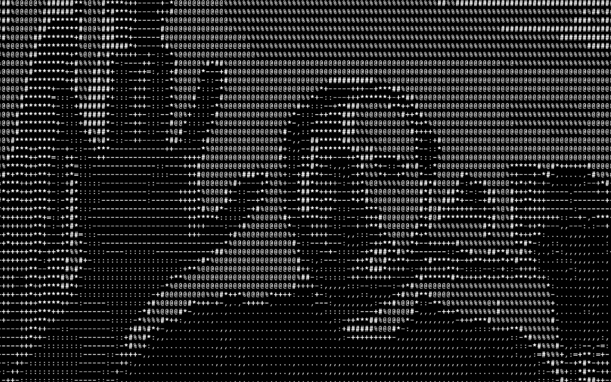

# ascii-art

Convert a movie/image (as texture) to ascii characters in Max-Jitter. Set a custom characterset for conversion. Real-Time transform of texture to ASCII.



- Ascii grayscale character set from: http://paulbourke.net/dataformats/asciiart/

# Install

Download zip
```
1. download zip
2. unzip
3. open ascii-art.maxpat
```
Git clone
```
1. $ cd ~/Documents/Max\ 8/Projects
2. $ git clone https://github.com/tmhglnd/ascii-art.git
3. $ open ascii-art.maxpat
```

# Output realtime texture

For output of the texture to platforms like Skype, Jit.si, Zoom etc. you need to install the Spout (windows) or Syphon (mac) Package from the package manager.

## Mac

1. Install `Syphon` from the Package Manager (mac)
2. Enable Syhon/Spout output in the patcher.
3. On Mac you can use software like [CamTwist](http://camtwiststudio.com/download/) to setup a virtual camera device. Select Syphon as a source in CamTwist and Max as syphon input.

## Windows

1. Install `Spout` from the Package Manager (windows)
2. Enable Syhon/Spout output in the patcher.
3. Find some kind of Virtual Video Device software that can bridge the capture the Spout output and allows to be selected as camera input in the other platforms. *windows user contribute needed here*